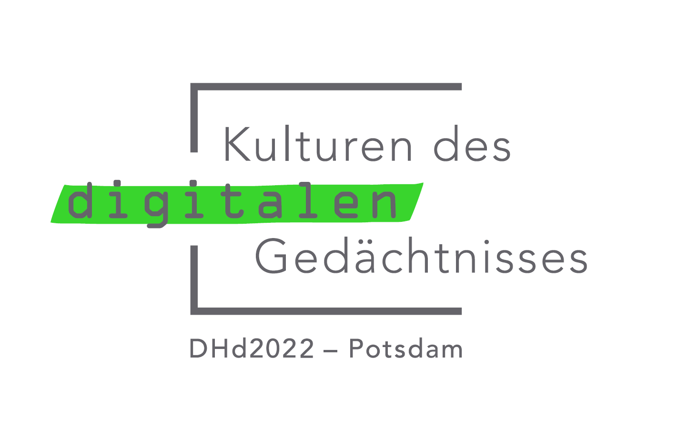

# DHd-Abstracts Zukunftslabor
Eine Veranstaltung der [vDHd2021](https://vdhd2021.hypotheses.org/) in Zusammenarbeit mit der [DHd2022](https://www.dhd2022.de/).

## hashtag
[#labstract](https://twitter.com/hashtag/labstract)

## Termin
Fr, 26.03.2021, 09 - 13 Uhr @ zoom

## Anmeldung
Die Veranstaltung ist für alle Interessierten offen. \
Um Anmeldung unter digital@ieg-mainz.de wird gebeten, bis Sonntag, 21.03.2021.

## Abstract des Abstracts
[https://vdhd2021.hypotheses.org/137](https://vdhd2021.hypotheses.org/137) \
Jede Community hat die Abstracts, die sie verdient? Die DHd-Konferenzabstracts sind das Schaufenster der digitalen Geisteswissenschaften und geben einen qualitätsgesicherten Stand der aktuellen Forschung wieder: who is who? and what happens where? Doch die innovative Community versteckt sich in einem traditionellen Sammelband (Book-of-Abstracts-PDF), während die Beiträge selbst nicht als autonome und referenzierbare Publikationen verfügbar sind. Und die Abstracts könnten sogar noch mehr: mit qualitätsgesicherten Metadaten, Normdatenanreicherung und offen lizenzierten XML-Daten werden aus den Abstracts die zukünftigen Forschungsdaten einer Wissenschaftsgeschichte der DH. Die DHd-Abstracts könnten zum Innovationstreiber der digitalen Konferenzpublikationen werden.
Wir laden die Community zu einem Zukunftslabor ein, in dem wir die Abstracts unter Mikroskop und Messer legen. Wir werden gemeinsam Probleme benennen, Potentiale entdecken und Aufwände abwägen, so dass die DHd Abstracts auf eine neue Stufe gehoben werden können: angereichert, ausgezeichnet, disambiguiert, indexierbar, nachhaltig, maschinenlesbar, referenzierbar oder kurz: besser, offener, reputierlicher.
Wir werden im Workshop versuchen, das Feld der Konferenzabstracts mit spannenden Impulsen zu beleuchten: historischer Abriss, innovative Webapplikationen, Graswurzelansätze, das Vereinsaufgebot, die Welt der Informatik, internationale Entwicklungen und ein Sneak Peak auf Potsdam. Eine offene und zielgerichtete Diskussion führt uns zu neuen Ideen und konkreten Plänen. Alle, die ein Herz für die DH und ein Interesse für digitales Publizieren vereinen, sind hier richtig. Jede Community hat die Abstracts, die sie verdient!

[Zum vollständigen Abstract](labstract-abstract)

## Highlights
- Eine sehr kurze Geschichte der DHd-Abstracts
- Die dhd-boas-app
- Die DH(d) Konferenzbeiträge Bibliografie
- Der DHd Data Steward
- Der Index of Digital Humanities Conferences
- Konferenzabstracts in der Informatik
- Die DHd-Abstracts für die DHd 2022 in Potsdam

## Hot-Seat-Fragen
- Was sind die Stärken und Schwächen der DHd-Abstracts?
- Wie verbessert ihr die DHd-Abstracts bis nächstes Jahr?
- Wo seht ihr die DHd-Abstracts in fünf Jahren?
- Wie werden die DHd-Abstracts zu qualitätsvollen Daten?
- Wie werden die DHd-Abstracts zu reputierlichen Publikationen?

## Ressourcen
- [Zotero Library zu (DH(d)-)Abstracts](https://www.zotero.org/groups/2671212/dhd-abstracts)

## Beteiligte
* Peter Andorfer, <a href="https://orcid.org/0000-0002-9575-9372"> 0000-0002-9575-9372</a>, Österreichische Akademie der Wissenschaften, Austrian Centre for Digital Humanities and Cultural Heritage (ACDH-CH), <a href="https://twitter.com/csae8092"> csae8092</a>
* Anna Busch, <a href="https://orcid.org/0000-0001-5584-4807"> 0000-0001-5584-4807</a>, Theodor-Fontane-Archiv, Universität Potsdam, <a href="https://twitter.com/annaarchiv"> annaarchiv</a>
* Fabian Cremer, <a href="https://orcid.org/0000-0001-8251-9727"> 0000-0001-8251-9727</a>, Leibniz-Institut für Europäische Geschichte (IEG), <a href="https://twitter.com/fabian_cremer"> fabian_cremer</a>
* Nickoal Eichmann-Kalwara, <a href="https://orcid.org/0000-0002-8851-852X"> 0000-0002-8851-852X</a>, University of Colorado Boulder, <a href="https://twitter.com/nickoaleichmann"> nickoaleichmann</a>
* Andreas Henrich, [Universität Bamberg](https://www.uni-bamberg.de/minf/team/henrich/)
* Patrick Helling, <a href="https://orcid.org/0000-0003-4043-165X"> 0000-0003-4043-165X</a>, DHd Data Steward, Universität zu Köln, <a href="https://twitter.com/helling_patrick"> helling_patrick</a>
* Matthew Lincoln, <a href="https://orcid.org/0000-0002-4387-3384"> 0000-0002-4387-3384</a>, Carnegie Mellon University, <a href="https://twitter.com/matthewdlincoln"> matthewdlincoln</a>
* Harald Lordick, <a href="https://orcid.org/0000-0002-5070-4263"> 0000-0002-5070-4263</a>, Steinheim-Institut, <a href="https://twitter.com/nubuker"> nubuker</a>
* Dennis Mischke, <a href="https://orcid.org/0000-0001-8892-5419"> 0000-0001-8892-5419</a>, Universität Potsdam, <a href="https://twitter.com/dennmis"> dennmis</a>
* Timo Steyer, <a href="https://orcid.org/0000-0003-0218-2269"> 0000-0003-0218-2269</a>, Technische Universität Braunschweig, Universitätsbibliothek, <a href="https://twitter.com/steyer_ti"> steyer_ti</a>
* Scott B. Weingart, <a href="https://orcid.org/0000-0003-4802-1364"> 0000-0003-4802-1364</a>, Carnegie Mellon University, <a href="https://twitter.com/scott_bot"> scott_bot</a>
